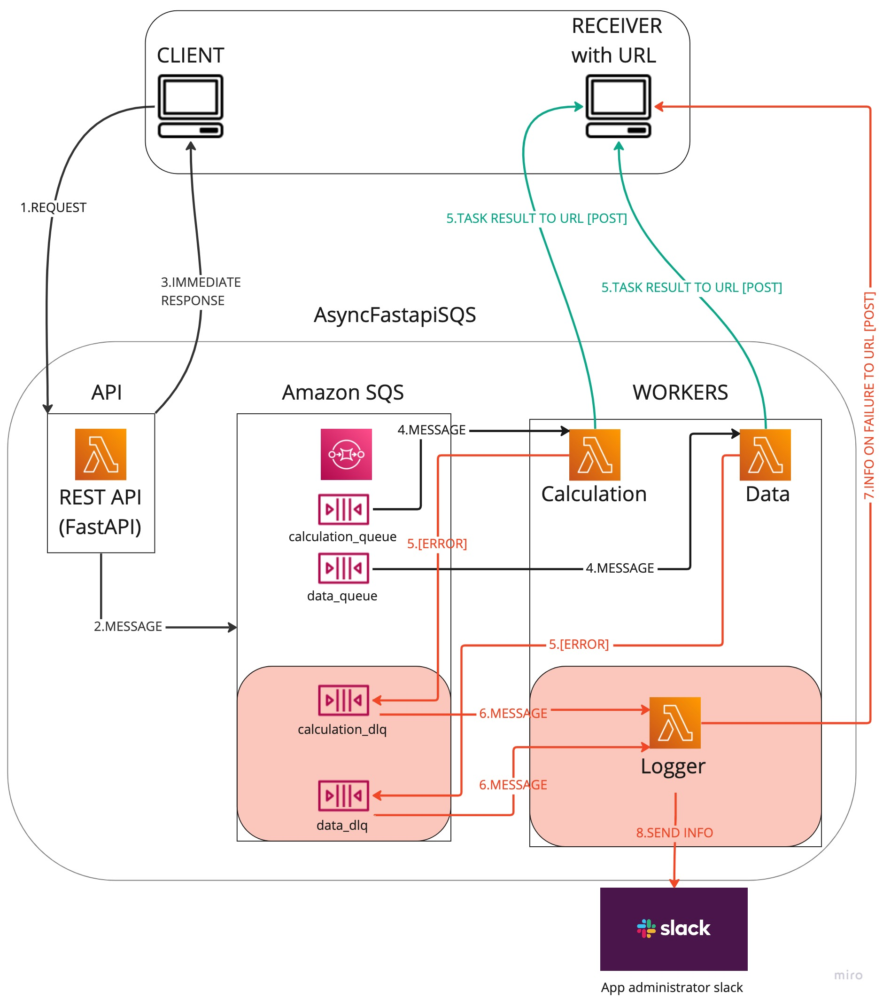

# Async FastAPI SQS 

## Overwiev

This is a web service built with **microservices** offering API gateway in form of FastAPI REST API (deployed as AWS lambda)
and is able to perform async tasks using SQS queues to communicate with workers
 (which are also lambda functions). This is AWS-microservice, more elastic version of the service which can be found in the `AsyncFastapiCelery` folder.

The service can perform two example tasks:
1. Basic calculation (addition, subtraction, multiplication and division) on any number of pairs of numbers
2. Fetching data from any number of REST APIs (which return a json response) using GET or POST request

These tasks are artificially delayed to demonstrate the asynchronous operation of the service and to mimic processes that are not immediate.

Services that perform asynchronous tasks tend to "swallow errors".
**AsyncFastapiSQS** service is an example of using a distributed microservices architecture
designed to minimize the risk of "swallowing errors" and inform the Client of any errors 
at each stage of the process.


### How it works



1. Client sends POST request to API endpoint in which `callback_url` has to be passed to receive result of operation (`RECEIVER` has to be able to accept `POST` request)
    
    example request payload: 
    ```json
    {
      "callback_url": "https://qju5rcoarg6a4bpxjf3joj3x7y0cfyfk.lambda-url.eu-west-1.on.aws/",
      "message": [
        {
          "name": "calc_0",
          "num_1": 123,
          "num_2": 0.75647,
          "operation": "+",
          "result_rounding": 2
        },
        {
          "name": "calc_1",
          "num_1": 785687256,
          "num_2": 0.75647,
          "operation": "-",
          "result_rounding": 4
        }
      ]
    }
    ```
2. If request structure is correct, API sends a message to proper SQS queue (depending on request endpoint).
3. If request structure is not correct, the client get `[422] Error: Unprocessable Entity` response detailing the error in the request structure.

   If at this stage the message fails to be sent to the queue, the client gets `[500] internal error` response.

   If the message was successfully sent to the queue, the client receives a `[200]` response containing the `task_id` 
for its request as well as information about the structure of the response,
which will be passed to the `callback_url` after the task is completed:

     ```json
    {
    "message": "Processing of your request has started",
    "task_id": "c558a80a-f319-4c10-95d4-4282ef745b4b",
    "async_job_response_structure": {
    "results": [{}],
    "errors": [{}],
    "task_id": "c558a80a-f319-4c10-95d4-4282ef745b4b"
   }
   }
    ```
4. Message in queue triggers proper lambda function(worker) and is passed to it to perform task.
5. If the task is completed, the worker sends its result to the `callback_url` via `POST` request and the process is finished.
    
   example message after task completion: 
    ```json
    {
   "results": [
   {
   "calc_0": 123.76
   },
    {
   "calc_1": 785687255.2435
   }
   ],
   "errors": [
   
   ],
   "task_id": "c558a80a-f319-4c10-95d4-4282ef745b4b"
   }
    ```
   
[ERROR] scenario:
5. If an error occurs in the worker after a message is delivered to it, the queue can retry a certain number of times
(to be set, in this case: 3 for the calculation worker and 1 for the data worker) and with an appropriate delay (settable),
and if all attempts fail, the message goes to the dead letter queue (one dlq for each queue).
6. The presence of a message in any of the dlq calls the logger function,
which processes the message that the worker failed to process correctly.
7. Logger sends to `callback_url` information about task failure (error is not "swallowed", `callback_url` is called even in case of error in worker)
8. Logger sends information on message in dlq to administrator's slack (if configured- `SLACK_BOT_TOKEN` and `SLACK_CHANNEL` can be set in `workers/.env` file)


### Project structure
`api` directory contains code of FastAPI REST API

Using [FastAPI](https://fastapi.tiangolo.com/) to build a REST API, we can easily define the required request structure for each endpoint,
gain automatic request validation, descriptive errors in case of inconsistencies,
and automatically created swagger and redoc documentation.
In addition, by using the [mangum](https://mangum.io/) module, we are able to deploy the API as a simple AWS lambda with url.

`workers` directory contains code of lambda functions which are triggered by SQS queues:
`calculation`, `data` and `logger`- each in separate sub-folder, with its own requirements.txt file is packed separately during deployment.

`receiver` directory contains example code of very simple lamda function with url which can be deployed and used as `RECEIVER` with `callback_url`

### How to try it out
The project is prepared to be deployed to AWS using [serverless](https://www.serverless.com/) framework.
By using [serverless compose](https://www.serverless.com/framework/docs/guides/compose)
it is possible to deploy all components of the service at once 
(API and workers, including sqs ques and dead letter queues creation and their relation with workers;
receiver is not set to be deployed along with the service since functionally it's separate application- meant to be a part of client's side system).

1. To deploy the service you have to have [AWS account](https://aws.amazon.com/) and [AWS CLI](https://aws.amazon.com/cli/) installed and configured
2. Before deployment go to `api/.env.example` and `workers/.env.example`, complete these files with required info and change their names to `.env`
(if you want to complete `EXAMPLE_RECEIVER_URL` with url of receiver from this project,
first go to p.3)
3. [Install Serverless](https://www.serverless.com/framework/docs/getting-started#upgrade)
4. If you want to deploy `receiver`, open Terminal and go to 'AsyncFastapiSQS/receiver' folder, if not- go to p.6
5. Inside `receiver` folder run `serverless deploy` and after successful deployment receiver url will be displayed in Terminal
6. Open Terminal, go to `AsyncFastapiSQS` folder
7. Inside `AsyncFastapiSQS` folder run `serverless deploy` (installing of serverless compose may be needed)
8. After successful deployment you can find API url in `.serverless/compose.log` file
9. Click this link, go to swagger documentation and try the service (pass proper `callback_url` in request to receive final task result)

<hr>

Thanks for your visit, feel free to contact me on [LinkedIn](https://www.linkedin.com/in/daniel-pyrzanowski-77503b251)